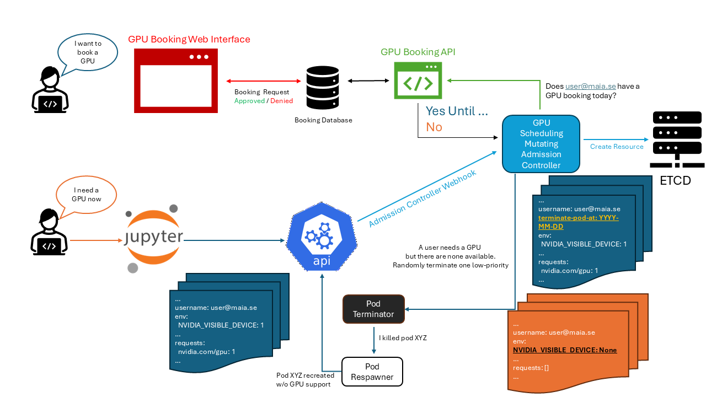

# GPU Booking System

## Motivation

GPU Cards are expensive and are a shared resource in a lab. To make sure that everyone gets a fair share of the GPU resources, a booking system is needed. This booking system will allow users to book a GPU card for a specific time slot. The booking system will also allow users to cancel their booking if they no longer need the GPU card.





## Installation

The GPU Booking System is a standalone service that can be installed on any Kubernetes cluster. The installation is performed by deploying the `gpu-booking` Helm chart:

```bash
helm install gpu-booking gpu-booking -n gpu-booking --create-namespace
```

The custom values for the GPU Booking component can be set in the `values.yaml` file. The following values can be customized:
```yaml
apiUrl: "https://maia.app.cloud.cbh.kth.se/maia-api/gpu-schedulability/" # The URL of the GPU Schedulability API service from the MAIA Dashboard
apiToken: "secret-token" # The API token for the GPU Schedulability API service
namespace: "gpu-booking" # The namespace where the GPU Booking component is deployed
```

## GPU Booking Post Installation Steps


The GPU booking system includes a webhook that validates the GPU requests. The webhook requires a CA certificate to be installed in the Kubernetes cluster. The CA certificate is stored in a secret named `gpu-booking-webhook-tls`. The CA certificate is generated during the installation of the GPU Booking component.

After approving and signing the certificate signing request (CSR) for the webhook, the CA certificate is stored in the secret `gpu-
booking-webhook-tls`. You need to manually extract the CA certificate from the secret and update the webhook configuration to use the CA certificate.


After installing the GPU Booking component as an Helm chart, you need to perform the following steps to complete the installation:

```bash
kubectl patch mutatingwebhookconfiguration gpu-booking-webhook -n gpu-booking --type='json' -p="[{'op': 'replace', 'path': '/webhooks/0/clientConfig/caBundle', 'value': \"$(kubectl get secret gpu-booking-webhook-tls -n gpu-booking -o jsonpath='{.data.ca\.crt}')\"}]"
```