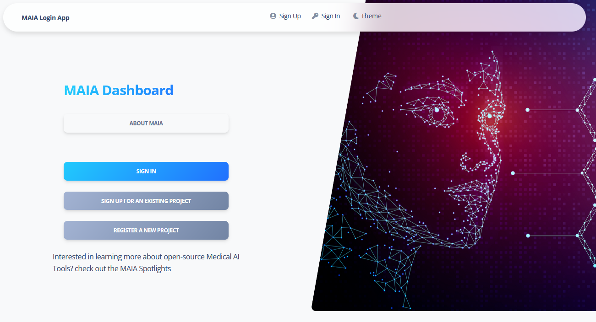
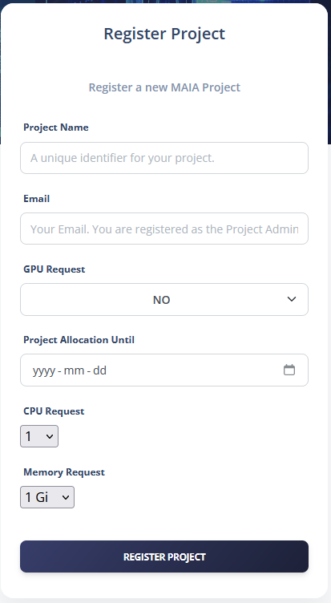
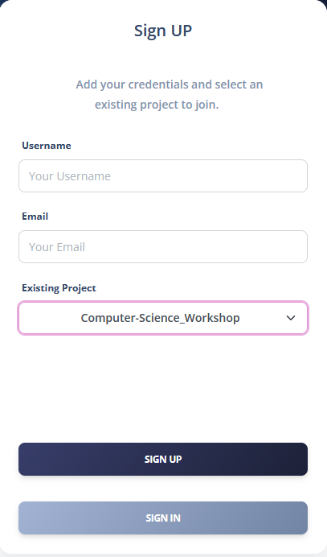
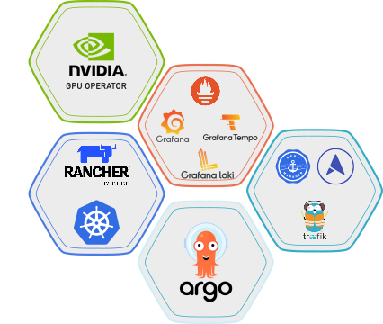
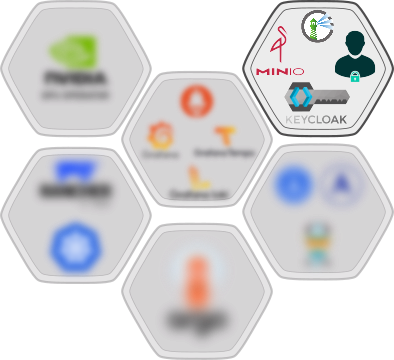
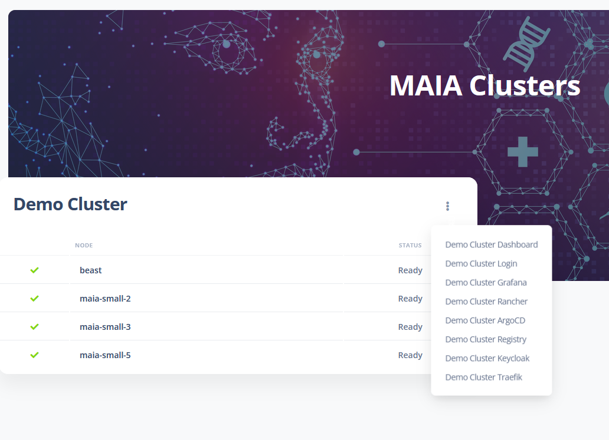
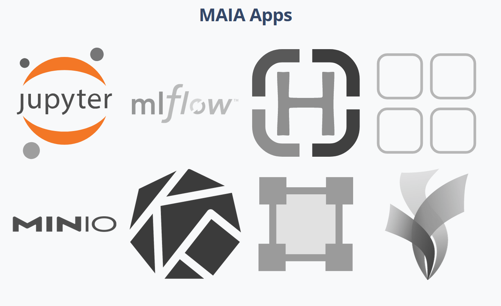

# MAIA Dashboard

This project is a fork of the [Soft UI Dashboard Django](https://appseed.us/product/soft-ui-dashboard/django/) project.

The MAIA Dashboard is a web application built using Django that provides an interface for managing Users and Projects in MAIA. The dashboard allows users to register for an account, request a project, and manage the resources associated with the project. The dashboard also provides an overview of the MAIA API, including the associated clusters and nodes, together with the status of the services deployed on the clusters.
This README will guide you through setting up the environment, starting the project, and understanding the different apps included in the dashboard.

## Environment Setup

Set the environment by saving the following environment variables in a `env.env` file in the root directory of the project:

```yaml
# OpenID Connect Configuration used for authentication and user management
OIDC_RP_CLIENT_ID: OpenID Connect client ID.
OIDC_RP_CLIENT_SECRET: OpenID Connect client secret.
OIDC_USERNAME: OpenID Connect username.
OIDC_ISSUER_URL: OpenID Connect issuer URL.
OIDC_SERVER_URL: OpenID Connect server URL.
OIDC_REALM_NAME: OpenID Connect realm name.
OIDC_OP_AUTHORIZATION_ENDPOINT: OpenID Connect authorization endpoint.
OIDC_OP_TOKEN_ENDPOINT: OpenID Connect token endpoint.
OIDC_OP_USER_ENDPOINT: OpenID Connect user endpoint.
OIDC_OP_JWKS_ENDPOINT: OpenID Connect JWKS endpoint.
OIDC_RP_SIGN_ALGO: OpenID Connect signing algorithm.
OIDC_RP_SCOPES: OpenID Connect scopes.

DEBUG: Debug mode.
# Server URL used for generating full URLs for the API
SERVER: Server URL.

# MinIO Configuration used for storing and reading PIP/Conda environments. Optional, to be specified if using MinIO
MINIO_URL: MinIO server URL.
BUCKET_NAME: MinIO bucket name.
MINIO_ACCESS_KEY: MinIO access key.
MINIO_SECRET_KEY: MinIO secret key.
MINIO_SECURE: MinIO secure connection flag.

# MySQL Configuration used for storing user data. Optional, to be specified if using MySQL
DB_ENGINE: Database engine.
DB_NAME: Database name.
DB_HOST: Database host.
DB_PORT: Database port.
DB_USERNAME: Database username.
DB_PASS: Database password.

# SQLite Configuration used for storing user data. Optional, to be specified if using SQLite
LOCAL_DB_PATH: Local database path.

MAX_MEMORY: Maximum memory allocation.
MAX_CPU: Maximum CPU allocation.

# Discord Webhook URL used for sending notifications
DISCORD_URL: Discord webhook URL.
DISCORD_SIGNUP_URL: Discord signup URL.
# Default Ingress Host, used for generating full URLs for the Kubernetes Ingress
DEFAULT_INGRESS_HOST: Default ingress host.

#ArgoCD Configuration
ARGOCD_SERVER: ArgoCD server URL.
ARGOCD_CLUSTER: ArgoCD cluster name. Should match any cluster name in the cluster configuration JSON file.
```

Additionally, set the following environment paths to deploy MAIA Namespaces from the dashboard:

```yaml	
CONFIG_PATH: Path to the configuration folder (--config-folder).
MAIA_CONFIG_PATH: Path to the MAIA configuration file (--maia-config-file).
CLUSTER_CONFIG_PATH: Path to the cluster configuration folder, containing the cluster config files (--cluster-config-file).
```

## MAIA Dashboard



The MAIA Dashboard includes several Django apps, each responsible for different functionalities:


### Project Registration
The first step in using the MAIA API is to register a project. The Project Registration app allows users to request a project on the MAIA API. Users can specify the project name, the requested resources (GPUs, CPUs, Memory), the allocation time, and the custom PIP/Conda environments. The request is then sent to the administrators, who can approve or reject it.
<p align="center">
    
</p>


### User Registration
The User Registration allows users to request an account on the MAIA and register for an existing project. Users can register with their username and email. The request is then sent to the administrators, who can approve or reject it. Upon approval, the user receives an email with the login credentials and the link to the MAIA Homepage.
<p align="center">
    
</p>


### Home

The home page displays an overview of the MAIA API, including the associated clusters and nodes together with their status. For each cluster, the users can access the different MAIA Core an MAIA Admin service, deployed on the cluster for managing the Kubernetes cluster.

**MAIA Core**:
<p align="center">
    
</p>

- Traefik: A reverse proxy and load balancer that allows users to access the services deployed on the Kubernetes cluster.
- Kubernetes Dashboard: A web-based UI for managing the Kubernetes cluster, including viewing the cluster's status, deploying applications, and managing the cluster's configuration.
- Rancher: A Kubernetes management platform that allows users to manage the Kubernetes cluster, deploy applications, and monitor the cluster's status.
- ArgoCD: A GitOps continuous delivery tool for Kubernetes that allows users to deploy applications and manage the cluster's configuration using Git repositories.
- Grafana: A monitoring and observability platform that allows users to monitor the cluster's status, including the CPU, Memory, and GPU usage.

**MAIA Admin**:

<p align="center">
    
</p>

- MinIO Operator: A Kubernetes operator that allows users to deploy MinIO, a high-performance object storage server, on the Kubernetes cluster.

- Login App: A Django app that allows users to log in to the MAIA API using OpenID Connect authentication.

- Keycloak: An open-source identity and access management tool that allows users to manage the users and roles associated with the MAIA API.

- Harbor: A container image registry that allows users to store and distribute container images.

The access is conditional on the user's role (admin or user) and associated policies. Admins can access all the services, while users can only access the services associated with their namespaces.

<p align="center">
    
</p>

### MAIA Namespaces [Projects]

Each user can view the namespaces associated with their account, inspecting the MAIA applications and services running in each namespace (JupyterHub, Orthanc, Remote Desktops, MLFlow, etc.).
Two additional tables display the Remote Desktops/SSH links to the individual user workspaces and the Orthanc DICOM server links, to view the medical images stored in the Orthanc server and upload/download DICOM files with the Orthanc DICOM-Web REST API.

<p align="center">
    
</p>


### Resources

The *Resources* page allows administrators to manage the resources associated with the MAIA API. This includes inspecting the available resources (GPUs, CPUs, Memory), and the current GPU allocations with the users associated with each GPU.

### User Management

The *MAIA Users and Projects* page allows administrators to manage the users associated with MAIA. This includes viewing the users who requested an account, approving or rejecting the requests, together with the associated namespaces (projects) and requested resources. Administrators can deploy new namespaces for users and manage the resources associated with each namespace. The Namespace (Project) management is done using the ArgoCD tool, which allows users to deploy applications and manage the cluster's configuration using Helm charts and Git repositories.
