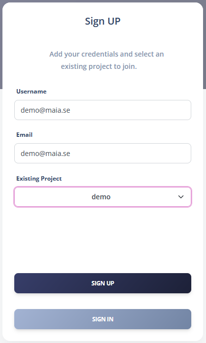
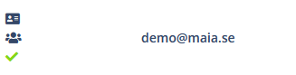
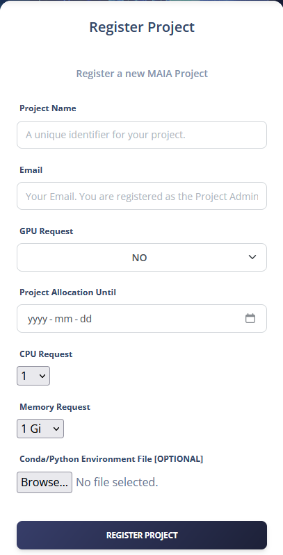
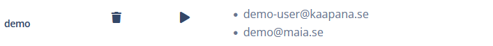

# MAIA Dashboard Documentation

The MAIA Dashboard is a web-based application that provides a user-friendly interface to interact with the MAIA platform. The dashboard allows users to request project allocations, link their account to a project, and access the project-specific tools and resources.

Additionaly, the MAIA Dashboard is used to manage a number of platform operations, such as user, project, and resource management, as well as monitoring and logging.


## User Management

### Registering a New User

To register a new user, the user must fill out the registration form with their username and email address. The request is then sent to the administrators for approval.
MAIA administrators can approve the user registration request by clicking on the "ID" icon, the top one next to the user entry. By clicking on the "ID" icon, the corresponding Keycloak user will be created and the user will be able to log in to the MAIA Dashboard. Once the User is correctly registered to Keycloak, the same icon will be replaced by a green check mark.
<p align="center">
    
</p>

### Linking a User to an Existing Project

The user can link their account in the registration form, where they can select the project they want to be linked to. 
In the Users page, MAIA administrators can approve the user liking request to a project by clicking on the "group" icon, the middle one next to the user entry. By clicking on the "group" icon. By clicking on the "group" icon, the corresponding Keycloak user will be assigned to the Keycloak group corresponding to the project. Once the User is correctly linked to the project, the same icon will be replaced by a green check mark.
A list of all the users part of the project is available in the same page
<p align="center">
    
</p>

## Project Management

### Approving Project Requests

Users can request a new project by filling out the project request form. The request is then sent to the administrators for approval.
The requested project will appear in the Projects and Users pages, where MAIA administrators can approve it by registering the corresponding Keycloak group and deploying the MAIA Namespace in the cluster. The Keycloak group will be created by clicking on the "group" icon, the top one on the first column next to the project entry. 
<p align="center">
    
</p>

### Deploying Projects [ArgoCD and Re-Sync]
The MAIA Namespace can be deployed by clicking on the "deploy" icon, on the second column next to the project entry. By clicking on the "deploy" icon, the corresponding ArgoCD application will be created and the project will be deployed in the cluster. Once the Project is correctly registered to Keycloak and deployed in the cluster, the same icons will be replaced by the "update" button.

<p align="center">
    
</p>

IMPORTANT!

If MAIA is deployed as an extension in Kaapana, you will need to enable the corresponding project namespace in the Traefik deployment(in the `admin` namespace):
```bash
--providers.kubernetesingress.namespaces=admin,jobs,services,extensions,<project_1>,<project_2>,...
```

### Deleting Projects


## Resource Management

### Monitoring Cluster Status

### Monitoring GPU Allocations

### Cluster Management and Monitoring


### GPU Booking System


## Automatic Email Notifications